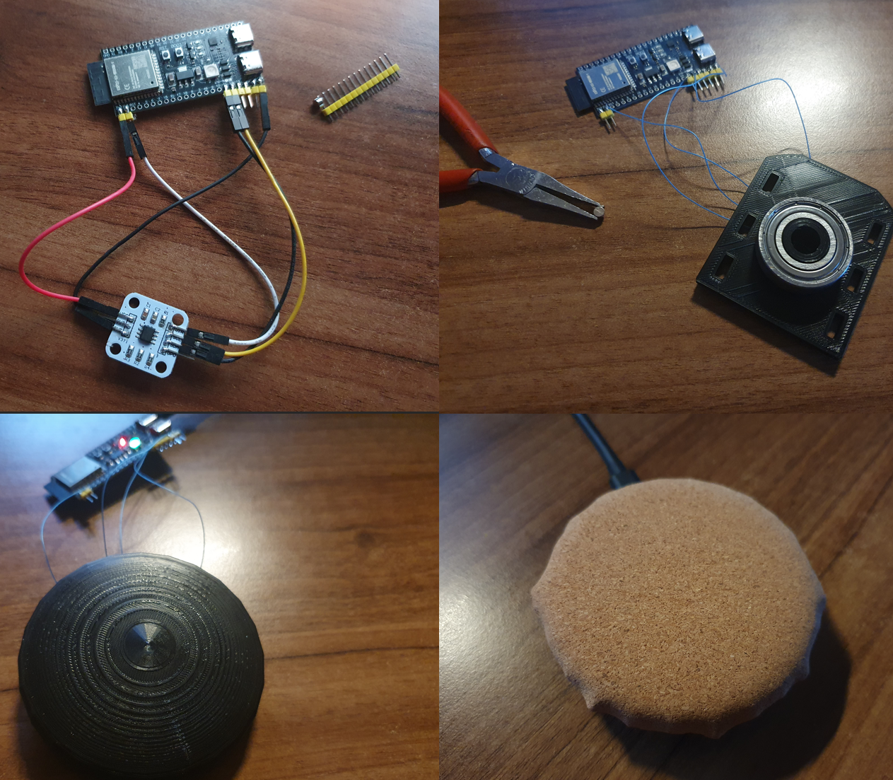

# Scroller
BLE HID Scroll wheel based on ESP32 and AS5600

#### USP:
- Uses the Resolution Multiplier of a HID Mouse thus allowing pixel accurate scrolling if one tinkers long enough with the settings

#### Components:
- ESP32 (YD-ESP32-S3) - any other should also work as long as it has BLE
- AS5600 - magnetic encoder
- 32mm (outside) bearing
- 3d print files 

#### Common issues:
- In Windows every time you change the HID Descriptor make sure to remove the paired device via the Bluetooth device screen, not Device Manager as that does not clear the stored Descriptor!

#### Todo:
- Cleanup code, reduce Report Descriptor to V Scroll only + Multiplier
- Refine STL files to fix some clearance issues + Add more designs
- Adjustable multiplier, maybe also increase range
- Better smoothing, input control, hardcoded as of now
- Battery support/integration
- Auto sleep / power saving
- HID via OTG USB, so that it works without BLE as well PnP

#### References/Credits:
- https://usb.org/sites/default/files/hut1_2.pdf
- https://github.com/T-vK/ESP32-BLE-Mouse
- https://libevdev.pages.freedesktop.org/udev-hid-bpf/example-report-descriptor.html
- https://github.com/dieki-n/OpenDial
- https://www.youtube.com/watch?v=FSy9G6bNuKA
